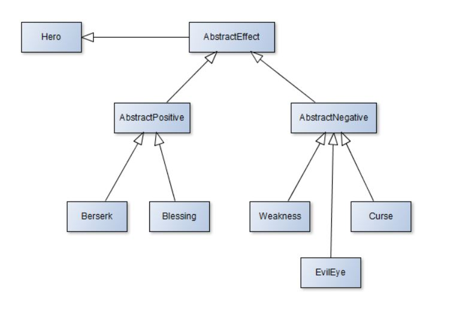

# Создание декоратора класса

У вас есть герой, который обладает некоторым набором характеристик. Враги и союзники могут накладывать на героя положительные и отрицательные эффекты. Эти эффекты каким-то образом изменяют характеристики героя. На героя можно накладывать бесконечно много эффектов, действие одинаковых эффектов суммируется. Игрок должен знать, какие положительные и какие отрицательные эффекты на него были наложены и в каком порядке.

Класс герой описан следующим образом (характеристики могут быть другими):

    class Hero:
        def __init__(self):
            self.positive_effects = []
            self.negative_effects = []            
            self.stats = {
                "HP": 128,
                "MP": 42,
                "SP": 100,
                "Strength": 15,
                "Perception": 4,
                "Endurance": 8,
                "Charisma": 2,
                "Intelligence": 3,
                "Agility": 8,
                "Luck": 1
            } 
            
        def get_positive_effects(self):
            return self.positive_effects.copy()
        
        def get_negative_effects(self):
            return self.negative_effects.copy()
        
        def get_stats(self):
            return self.stats.copy()

Вам нужно написать систему декораторов, представленную на UML-диаграмме:

Названия наложенных положительных и отрицательных эффектов добавляются каждое в свой счетчик. Названия эффектов совпадают с названиями классов.

Описания эффектов:

- **Берсерк** — Увеличивает параметры *Сила*, *Выносливость*, *Ловкость*, *Удача* на 7; уменьшает параметры *Восприятие*, *Харизма*, *Интеллект* на 3. Количество единиц здоровья увеличивается на 50.
- **Благословение** — Увеличивает все основные характеристики на 2.
- **Слабость** — Уменьшает параметры *Сила*, *Выносливость*, *Ловкость* на 4.
- **Сглаз** — Уменьшает параметр *Удача* на 10.
- **Проклятье** — Уменьшает все основные характеристики на 2.
К основным характеристикам относятся Сила (Strength), Восприятие (Perception), Выносливость (Endurance), Харизма (Charisma), Интеллект (Intelligence), Ловкость (Agility), Удача (Luck).

При выполнении задания учитывайте, что:

- Изначальные характеристики базового объекта не должны меняться.
- Изменения характеристик и накладываемых эффектов (баффов/дебаффов) должно происходить динамически, то есть при запросе `get_stats`, `get_positive_effects`, `get_negative_effects`
- Абстрактные классы `AbstractPositive`, `AbstractNegative` и соответственно их потомки могут принимать любой параметр base при инициализации объекта (`__init__(self, base)`)
- Проверяйте, что эффекты корректно снимаются, в том числе и из середины стека

**Решение**:

    class AbstractEffect(Hero, ABC):
        def __init__(self, base):
            self.base = base

        @abstractmethod
        def get_positive_effects(self):
            return self.positive_effects

        @abstractmethod
        def get_negative_effects(self):
            return self.negative_effects

        @abstractmethod
        def get_stats(self):
            pass

    class AbstractPositive(AbstractEffect):
        def get_negative_effects(self):
            return self.base.get_negative_effects()

    class AbstractNegative(AbstractEffect):    
        def get_positive_effects(self):
            return self.base.get_positive_effects()

    class Berserk(AbstractPositive):    
        def get_stats(self):
            stats = self.base.get_stats()
            stats["HP"] += 50
            stats["Strength"] += 7
            stats["Endurance"] += 7
            stats["Agility"] += 7
            stats["Luck"] += 7
            stats["Perception"] -= 3
            stats["Charisma"] -= 3
            stats["Intelligence"] -= 3
            return stats

        def get_positive_effects(self):
            return self.base.get_positive_effects() + ["Berserk"]

    class Blessing(AbstractPositive):    
        def get_stats(self):
            stats = self.base.get_stats()
            stats["Strength"] += 2
            stats["Endurance"] += 2
            stats["Agility"] += 2
            stats["Luck"] += 2
            stats["Perception"] += 2
            stats["Charisma"] += 2
            stats["Intelligence"] += 2
            return stats

        def get_positive_effects(self):
            return self.base.get_positive_effects() + ["Blessing"]

    class Weakness(AbstractNegative):    
        def get_stats(self):
            stats = self.base.get_stats()
            stats["Strength"] -= 4
            stats["Endurance"] -= 4
            stats["Agility"] -= 4
            return stats

        def get_negative_effects(self):
            return self.base.get_negative_effects() + ["Weakness"]

    class Curse(AbstractNegative):
        def get_stats(self):
            stats = self.base.get_stats()
            stats["Strength"] -= 2
            stats["Endurance"] -= 2
            stats["Agility"] -= 2
            stats["Luck"] -= 2
            stats["Perception"] -= 2
            stats["Charisma"] -= 2
            stats["Intelligence"] -= 2
            return stats

        def get_negative_effects(self):
            return self.base.get_negative_effects() + ["Curse"]

    class EvilEye(AbstractNegative):
        def get_stats(self):
            stats = self.base.get_stats()
            stats["Luck"] -= 10
            return stats

        def get_negative_effects(self):
            return self.base.get_negative_effects() + ["EvilEye"]
