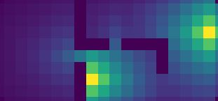

# Создание адаптера для класса

Вы продолжаете писать игру, и настало время разобраться с расчетом освещенности на карте. Так как это не совсем тривиальная задача, вы хотели бы использовать готовое решение, а не писать свое собственное. Вам удалось найти готовый класс, который решает задачу, однако интерфейс этого класса не совместим с вашей игрой.

Вам нужно написать адаптер, который позволил бы использовать найденный вами класс совместно с вашей системой.

Интерфейс класса выглядит следующим образом:

    class Light:
        def __init__(self, dim):
            self.dim = dim
            self.grid = [[0 for i in range(dim[0])] for _ in range(dim[1])]
            self.lights = []
            self.obstacles = []
            
        def set_dim(self, dim):
            self.dim = dim
            self.grid = [[0 for i in range(dim[0])] for _ in range(dim[1])]
        
        def set_lights(self, lights):
            self.lights = lights
            self.generate_lights()
        
        def set_obstacles(self, obstacles):
            self.obstacles = obstacles
            self.generate_lights()
            
        def generate_lights(self):
            return self.grid.copy()

Интерфейс системы выглядит следующим образом:

    class System:
        def __init__(self):
            self.map = self.grid = [[0 for i in range(30)] for _ in range(20)]
            self.map[5][7] = 1 # Источники света
            self.map[5][2] = -1 # Стены
        
        def get_lightening(self, light_mapper):
            self.lightmap = light_mapper.lighten(self.map)

Класс Light создает в методе `__init__` поле заданного размера. За размер поля отвечает параметр, представляющий из себя кортеж из 2 чисел. Элемент `dim[1]` отвечает за высоту карты, `dim[0]` за ее ширину. Метод `set_lights` устанавливает массив источников света с заданными координатами и просчитывает освещение. Метод `set_obstacles` устанавливает препятствия аналогичным образом. Положение элементов задается списком кортежей. В каждом элементе кортежа хранятся 2 значения: `elem[0]` -- координата по ширине карты и `elem[1]` -- координата по высоте соответственно. Метод `generate_lights` рассчитывает освещенность с учетом источников и препятствий.

Пример карты освещенности, полученной этим методом изображен на следующем рисунке:

В системе в конструкторе создается двухмерная, карта, на которой источники света обозначены как 1, а препятствия как -1. Метод `get_lightening` принимает в качестве аргумента объект, который должен посчитывать освещение. У объекта вызывается метод `lighten`, который принимает карту объектов и источников света и возвращает карту освещенности.

Вам необходимо написать адаптер `MappingAdapter`. Прототип класса вам дан в качестве исходного кода.

**Решение**

    class MappingAdapter:
        def __init__(self, adaptee):
            self.adaptee = adaptee

        def _get_objects_by_grid(self, descriptor, grid):
            result = []
            for i in range(len(grid)):
                for j in range(len(grid[0])):
                    if grid[i][j] == descriptor:
                        result.append((j, i))
            return result

        def lighten(self, grid):
            dim = (len(grid[0]), len(grid))
            self.adaptee.set_dim(dim)
            lights = self._get_objects_by_grid(1, grid)
            obstacles = self._get_objects_by_grid(-1, grid)
            self.adaptee.set_lights(lights)
            self.adaptee.set_obstacles(obstacles)
            return self.adaptee.generate_lights()
